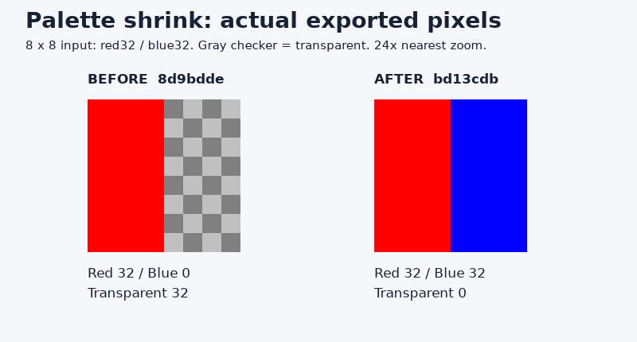
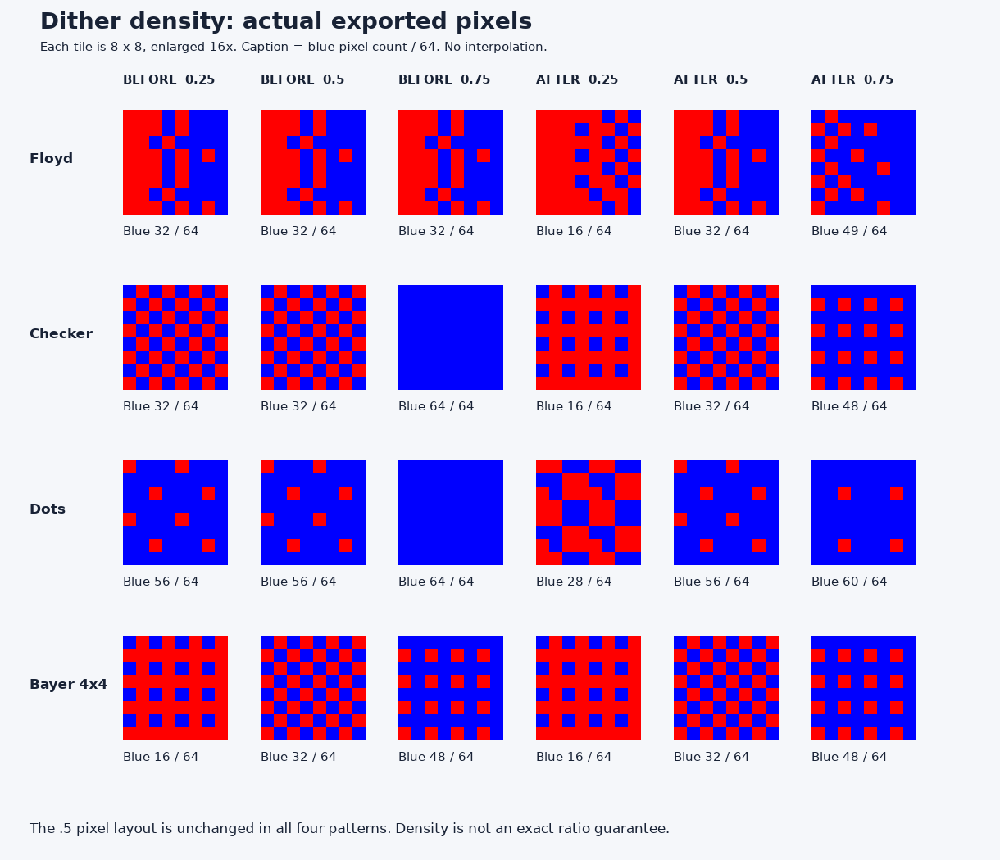

# MCP #22 반영 전후 실제 비교

2026-09-28 새 실행. 작업: [SHARED][TEST] MCP 리뷰 수정 반영 전후 비교.
플러그인 기준881028f(MCP8d9bdde)와 반영8066c09(MCPbd13cdb)를 비교했습니다.
전용 경로: $WORKTREE
브랜치: fix/shared-mcp-review-sync. PR #9는 2026-09-28 13:30:39 KST develop에 병합됐습니다(55c5697). CI SUCCESS이며, 병합 tree는 검증한8066c09와 동일합니다.

## 실행 방법

기준 커밋의 macOS arm64 배포 바이너리를 git show로 추출하고 당시 metadata SHA-256과
대조했습니다. 현재 플러그인 wrapper에서 이전 binary override와 현재 내장 binary를
각각 선택했습니다. 동일 client→MCP→실제 Aseprite1.3.18.2 경로로 이전56회/현재56회,
총112회 도구 호출을 실행했습니다. 정상 응답만 신뢰하지 않고 별도 Aseprite Lua inspector로
저장된 native 픽셀을 읽었습니다. 오류 없이 비교 단언이 통과했습니다.

이는 스킬을 자동 실행한 검사가 아니라 플러그인 wrapper/client를 사용한 직접 회귀 비교입니다.
분석용 low.png와 rare.png는 두 버전의 SHA-256이 동일합니다. native 생성·팔레트 작업은
동일한 입력 픽셀/인자/순서로 실행했으며 native 파일 바이트가 같다고 주장하지 않습니다.

## 1. 팔레트 축소: 실제 픽셀 손실 수정

입력은8×8 빨강32/파랑32. indexed 감색 후 팔레트를4개로 설정하고 미사용 끝2개를 제거했습니다.

| 측정 | 이전 | 현재 |
|---|---:|---:|
| 축소 전 빨강/파랑 | 32/32 | 32/32 |
| 축소 후 빨강/파랑/투명 | 32/0/32 | 32/32/0 |
| 투명 mask, 축소 전→후 | 3→1 | 255→255 |

이전에는 성공 응답이어도 파랑32픽셀이 사라졌습니다. 현재는 좌표별 색상64개가 유지됐습니다.
미사용 항목 축소 시의 투명 mask 문제를 검증한 것으로, 사용 중인 임의 palette index 삭제의
자동 remap이나 모든 팔레트 변경의 무손실을 보장하는 시험은 아닙니다.

## 2. 참조 threshold: 명시적0 보존

좌우 #646464/#656565 경계의 동일 PNG를8×8로 분석했습니다. 수치는 검출된 edge grid 셀 수입니다.

| edge_threshold | 이전 | 현재 |
|---|---:|---:|
| 0 | 0 | 12 |
| 1 | 12 | 12 |
| 30 | 0 | 0 |

이전0은 기본값30처럼 작동했고, 현재0은 실제 낮은 threshold로 경계를 검출합니다.

## 3. AA threshold: 후보 대비 필터 작동

투명 배경에 alpha64 흰색 계단을 그려 auto_apply=false로 비교했습니다.
수치는 실제 반환된 total_edges입니다. 이 fixture의 premultiplied 대비는64이며,
계약은 대비가 threshold보다 **클 때만** 후보를 남깁니다.

| threshold | 이전 | 현재 |
|---|---:|---:|
| 0 | 5 | 5 |
| 1 | 5 | 5 |
| 63 | 5 | 5 |
| 64 | 5 | 0 |
| 128 | 5 | 0 |
| 255 | 5 | 0 |

이전에는 값을 바꿔도5개였고, 현재는63/64 경계에서5→0으로 달라집니다.
전체 AA 알고리즘이나 그림 품질 개선을 판정한 시험이 아니라 기존 후보에 대비 필터가
실제로 적용되는지 검증한 것입니다. apply/오류 시 원본 보존은 아래 이전 실행에서 따로 확인했습니다.

## 4. density 중간값: 실제 파랑 픽셀 수

8×8 빨강/파랑 영역, 각 열의 순서는 density .25 / .5 / .75입니다.

| 패턴 | 이전 | 현재 |
|---|---|---|
| floyd_steinberg | 32 / 32 / 32 | 16 / 32 / 49 |
| checkerboard | 32 / 32 / 64 | 16 / 32 / 48 |
| dots | 56 / 56 / 64 | 28 / 56 / 60 |
| bayer_4x4 | 16 / 32 / 48 | 16 / 32 / 48 |

모든4개 패턴의 density .5 픽셀 해시는 전후 동일했습니다. 단순 개수뿐 아니라 배치도 유지됐습니다.
Floyd .75가49/64, dots .5가56/64인 점은 패턴별 결과이며 정확한 비율 계약은 아닙니다.

## 5. 희소색 분석

빨강63픽셀+초록1픽셀, palette_size5, 같은 PNG를 각 버전에서10회 분석했습니다.

| 측정 | 이전 | 현재 |
|---|---:|---:|
| 초록을 양의 usage로 포함한 횟수 | 0/10 | 10/10 |
| 빨강 usage 합 | 100% | 98.4375% |
| 초록 usage 합 | 0% | 1.5625% |
| 요청/반환 palette 항목 수 | 5/5 | 5/5 |

현재10회 결과는 서로 동일했습니다. 이번 이전10회도 모두 동일한 누락 결과였으므로
이번 시험에서 이전 버전의 비결정성까지 재현했다고 주장하지 않습니다.
요청한5개 항목은 유지되어 중복/usage0 항목은 남습니다. 큰 이미지의 모든 희귀색 보장은 아닙니다.

## 앞서 동일 후보에서 실행한 검증 — 이번112회와 별도

- 실제 Codex가 pixel-art-professional 스킬 및 제어 문서를 읽고 MCP12회 호출. reference0/30→12/0,
  checkerboard .25/.75의 빨강/파랑48/16 및16/48을 정확히 보고했습니다. native 독립 검사도 일치했습니다.
- 새 제어 회귀61회: 성공55, 잘못된 threshold 거부6; null/생략, preview/apply, 오류 원본 보존 포함.
- 기본7/7, 동작105/105, 스킬 레시피8/8, 감색36조합, warnings 성공23/오류3,
  live37회, export-analysis28회, apple231회·3애니메이션 및 엔진 검사 통과.

위 항목은 이 요청 직전8066c09 후보에서 실행한 기록이며 이번에 재실행했다고 합산하지 않습니다.
설치된 Codex 앱 자동 연결·GUI 및 다른 OS native 실행은 미검증입니다.

## 증거와 재현

- [호출112회 원자료](calls.json)
- [전후 결과·좌표별 픽셀·해시](results.json)
- [커밋 및 이전 binary checksum](provenance.json)
- 최초 실행 스크립트와 로그는 원래 worktree의 `test-outputs/review-comparison/{compare.py,run.log}`에 보관됩니다.
- 원자료의 절대 경로는 `$WORKTREE`로 치환했습니다. 수치·픽셀·순서는 변경하지 않았습니다.
- [HTML 보고서](REPORT.html)는 `python3 docs/reports/mcp22/build-report.py`로 재생성합니다.
- 재현: 전용 worktree에서 `test-outputs/venv/bin/python test-outputs/review-comparison/compare.py`

비교 실행 당시 제품 코드는 변경하지 않았습니다. 이 후속 문서 작업에서 보고서·선별 원자료·비교판을 저장소에 보관합니다. 이 문서 갱신으로 실제 MCP 테스트를 다시 실행한 것은 아닙니다.

## 실제 이미지 결과

26개 native 파일을 Aseprite로 PNG export하고 기록된 픽셀 수와 대조했습니다. 원본 파일 바이트는 보존됐습니다.

원본 PNG26개·이미지 출처 manifest·ZIP은 원래 worktree의 `test-outputs/review-comparison/`에 보존합니다. 저장소에는 비교판2개를 포함합니다.
